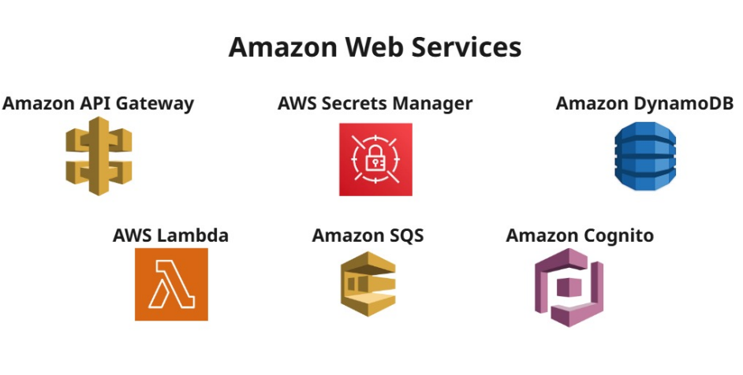
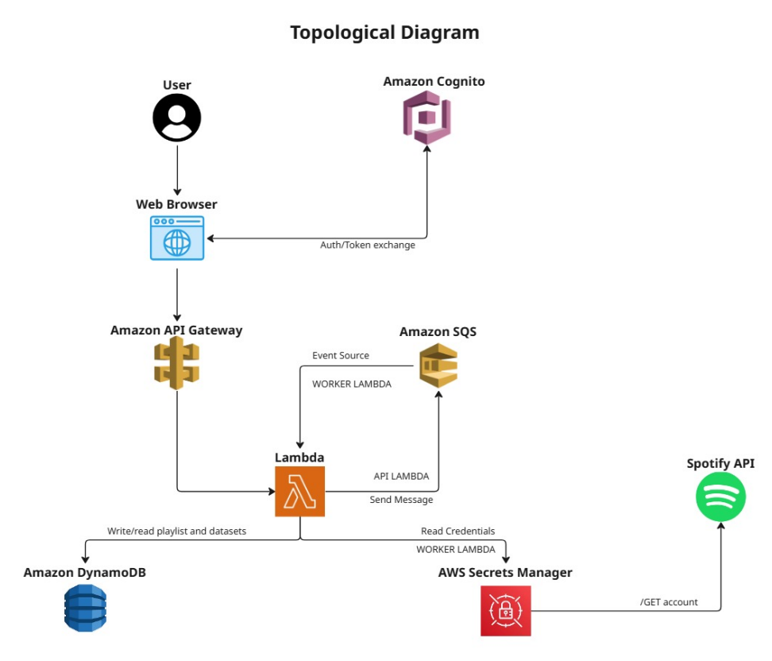
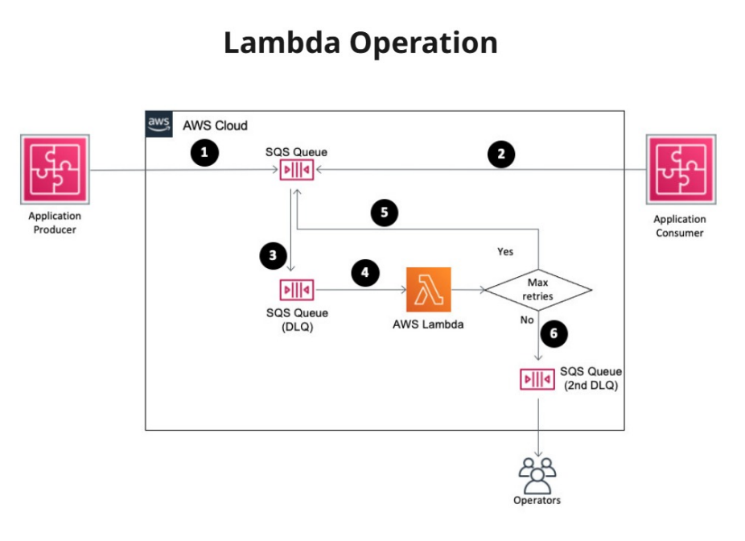

# ai-dj

## Project

AI-DJ: AWS infrastructure and Lambdas for playlist generation.

---

## Amazon Web Services Applications

- Amazon API Gateway: Managed HTTP ingress for REST endpoints, CORS, and routing to Lambda.
- AWS Lambda (API & Worker): Serverless compute—API Lambda validates requests and enqueues jobs; Worker Lambda builds playlists.
- Amazon SQS: Queue decoupling; smooths spikes by buffering requests and triggering the Worker.
- Amazon Cognito: User authentication and authorization via JWT tokens.
- AWS Secrets Manager: Secure storage and retrieval of Spotify credentials.
- Amazon DynamoDB: Fast, serverless storage for playlists and datasets.

How it works at a glance: The browser calls API Gateway, which invokes the API Lambda. Requests are placed on SQS; the Worker Lambda processes them, uses Secrets Manager to access Spotify, and persists playlists in DynamoDB for rapid retrieval.

---

## AWS Topological Diagram

Flow summary:
- Auth: Browser signs in with Cognito and receives JWTs.
- Ingress: Authenticated requests hit API Gateway → API Lambda.
- Async: API Lambda sends a compact message to SQS and returns immediately.
- Processing: SQS triggers Worker Lambda to assemble tracks, reading Secrets, calling Spotify.
- Data: Worker writes full playlist to DynamoDB; API Lambda reads from DynamoDB for GET requests.

Design benefits:
- Responsiveness: Users get quick acknowledgements; heavy work runs in the background.
- Scalability: Serverless components auto-scale; queue buffers spikes.
- Security: JWT-protected routes; secrets never reach the client.

---

## Lambda Operation

Processing model:
- Producer places messages onto SQS.
- Lambda consumes messages from SQS and performs playlist generation.
- Retries: Failed attempts are retried automatically up to the configured limit.
- Dead-letter handling: If a message keeps failing, it’s moved to a DLQ for operator review and replay (covered in detail on the DLQ slide).

Operational notes:
- Observe queue depth and age of oldest message to track backlog.
- Monitor Lambda duration/error rate; adjust concurrency if needed.
- Use DLQ metrics to prioritize investigation and remediation.
