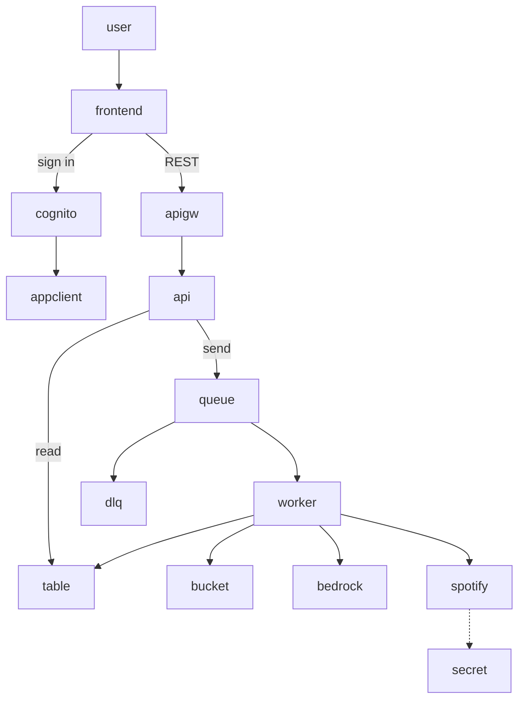
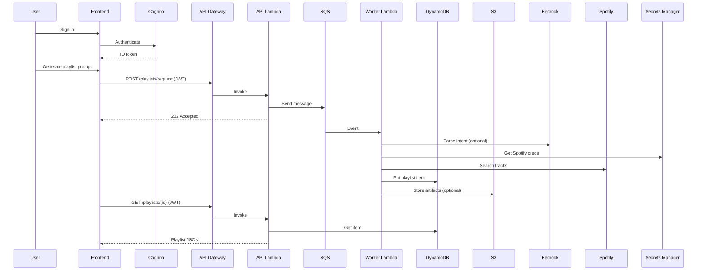

# AI-DJ AWS Infrastructure (CDK - Python)

This folder contains the AWS infrastructure for MusicForYou - AI DJ Assistant, implemented with AWS CDK (Python).

Components (Phase 1):
- DynamoDB table for playlists
- S3 bucket for datasets and generated audio
- SQS queue (+ DLQ) for async processing
- Cognito User Pool and App Client for auth
- API Gateway + Lambda (FastAPI) for REST endpoints
- Worker Lambda subscribed to SQS for Bedrock+Spotify orchestration (placeholder)

See detailed deployment/setup steps at the bottom of this file.

## Architecture (Mermaid)



### Request flow (Mermaid)


```

## Folder structure

aws/
- app.py                  CDK app entry
- cdk.json                CDK config
- requirements.txt        CDK Python deps
- infra/stack.py          CDK Stack with all resources
- lambdas/
	- api/                  FastAPI app (Mangum)
		- main.py
		- requirements.txt
	- worker/               SQS consumer worker
		- handler.py
		- requirements.txt

## Prerequisites

- AWS account with access keys configured locally
- Node.js (for AWS CDK CLI) and Python 3.11
- AWS CDK v2 (npm i -g aws-cdk)
- Permissions to enable Amazon Bedrock access in your account/region (console)

## Required AWS setup and keys

1) IAM user/role with permissions to deploy CDK and manage used services: CloudFormation, IAM, Lambda, APIGWv2, SQS, DynamoDB, S3, Cognito, Secrets Manager, Bedrock Invoke.
2) Enable Amazon Bedrock access to the foundation models you will use (console > Bedrock > Model access). For now, we only grant generic Invoke permissions; narrow later.
3) Optional: Create a Secrets Manager secret to store Spotify API credentials. Format suggestion (JSON):
	 {
		 "spotify_client_id": "...",
		 "spotify_client_secret": "...",
		 "spotify_redirect_uri": "https://localhost:3000/callback"
	 }
	 Copy the full secret ARN for deployment context (spotifySecretArn).

Environment/config values you will need/provide:
- AWS Account ID and target Region
- allowedOrigins: frontend origins for CORS (default includes localhost:3000 and *.vercel.app)
- bedrockRegion: usually same as your stack region
- spotifySecretArn: Secrets Manager ARN (optional for now; placeholder logic doesn’t require it)

## Deploy

1) Install CDK deps
	 - Create and activate a Python venv (optional but recommended)
	 - pip install -r requirements.txt

2) Bootstrap the environment (first time per account/region)
	 cdk bootstrap aws://<ACCOUNT>/<REGION>

3) Synthesize and deploy
	 cdk synth
	 cdk deploy \
		 -c bedrockRegion=<REGION> \
		 -c allowedOrigins='["http://localhost:3000","https://*.vercel.app"]' \
		 -c spotifySecretArn=<optional-secret-arn>

Outputs will include:
- HttpApiUrl
- TableName
- BucketName
- QueueUrl
- UserPoolId
- UserPoolClientId

## API endpoints (initial)

- GET /health
- POST /playlists/request  { prompt, user_id, count } -> { status: "queued" }
- GET /playlists/{playlist_id}

## Next steps (Phase 2+)

- Replace placeholder worker logic with Bedrock+LangChain orchestration and Spotify Web API integration.
- Add Cognito authorizers for protected routes.
- Add CloudWatch dashboards/alarms.
- Optionally split stacks (networking, data, compute) and add stages (dev/prod).

Optionally split stacks (networking, data, compute) and add stages (dev/prod).

