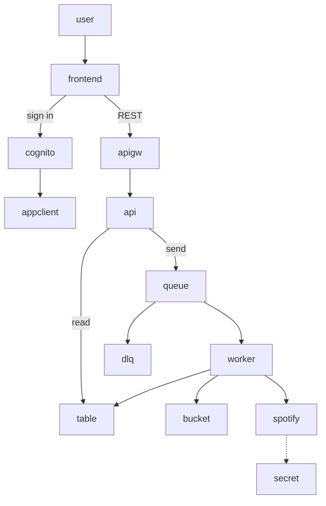
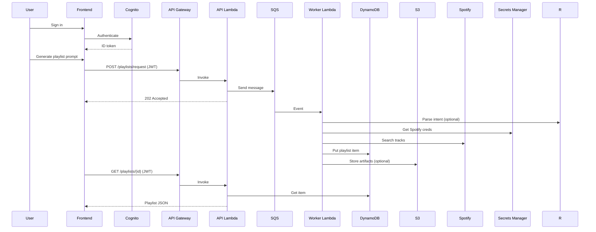

# AI-DJ AWS Infrastructure (CDK - Python)

This folder contains the AWS infrastructure for MusicForYou - AI DJ Assistant, implemented with AWS CDK (Python).

Components (Phase 1):
- DynamoDB table for playlists (metadata + pointers)
- S3 bucket for playlist payloads and datasets
- SQS queue (+ DLQ) for async processing
- Cognito User Pool and App Client for auth
- API Gateway + Lambda (FastAPI) for REST endpoints
- Worker Lambda subscribed to SQS for Spotify orchestration (placeholder)

See detailed deployment/setup steps at the bottom of this file.

## Architecture (Mermaid)


```mermaid
flowchart TD
	user --> frontend
	frontend -->|sign in| cognito
	cognito --> appclient

	frontend -->|REST| apigw
	apigw --> api

	api -->|send| queue
	api -->|read| table

	queue --> worker
	queue --> dlq

	worker --> table
	worker --> bucket
	worker --> spotify
	spotify -.-> secret
```

### Request flow (Mermaid)


```mermaid
sequenceDiagram
	participant U as User
	participant F as Frontend
	participant C as Cognito
	participant G as API Gateway
	participant A as API Lambda
	participant Q as SQS
	participant W as Worker Lambda
	participant D as DynamoDB
	participant B as S3
	participant S as Spotify
	participant X as Secrets Manager

	U->>F: Sign in
	F->>C: Authenticate
	C-->>F: ID token
	U->>F: Generate playlist prompt
	F->>G: POST /playlists/request (JWT)
	G->>A: Invoke
	A->>Q: Send message
	A-->>F: 202 Accepted

	Q->>W: Event
	W->>R: Parse intent (optional)
	W->>X: Get Spotify creds
	W->>S: Search tracks
	W->>D: Put playlist item
	W->>B: Store artifacts (optional)
	F->>G: GET /playlists/{id} (JWT)
	G->>A: Invoke
	A->>D: Get item
	A-->>F: Playlist JSON
```
```

## Folder structure

aws/
- app.py                  CDK app entry
- cdk.json                CDK config
- requirements.txt        CDK Python deps
- infra/stack.py          CDK Stack with all resources
- lambdas/
	- api/                  FastAPI app (Mangum)
		- main.py
		- requirements.txt
	- worker/               SQS consumer worker
		- handler.py
		- requirements.txt

## Prerequisites

- AWS account with access keys configured locally
- Node.js (for AWS CDK CLI) and Python 3.11
- AWS CDK v2 (npm i -g aws-cdk)

## Required AWS setup and keys

1) IAM user/role with permissions to deploy CDK and manage used services: CloudFormation, IAM, Lambda, APIGWv2, SQS, DynamoDB, S3, Cognito, Secrets Manager,
2) Optional: Create a Secrets Manager secret to store Spotify API credentials. Format suggestion (JSON):
	 {
		 "spotify_client_id": "...",
		 "spotify_client_secret": "...",
		 "spotify_redirect_uri": "https://localhost:3000/callback"
	 }
	 Copy the full secret ARN for deployment context (spotifySecretArn).

Environment/config values you will need/provide:
- AWS Account ID and target Region
- allowedOrigins: frontend origins for CORS (default includes localhost:3000 and *.vercel.app)
- spotifySecretArn: Secrets Manager ARN (optional for now; placeholder logic doesn’t require it)
 - dataBucketName: Existing S3 bucket name to use instead of creating one (optional). If omitted, the stack creates a bucket named aijdj-data-<account>-<region>.

## Deploy

1) Install CDK deps
	 - Create and activate a Python venv (optional but recommended)
	 - pip install -r requirements.txt

2) Bootstrap the environment (first time per account/region)
	 cdk bootstrap aws://<ACCOUNT>/<REGION>

3) Synthesize and deploy
	 cdk synth
     cdk deploy \
		 -c allowedOrigins='["http://localhost:3000","https://*.vercel.app"]' \
		 -c spotifySecretArn=<optional-secret-arn>

To use an existing S3 bucket instead of creating one:

    cdk deploy -c dataBucketName=<your-existing-bucket-name>

Note: When using an imported bucket, its settings (encryption, versioning, lifecycle) are managed outside CDK.

Outputs will include:
- HttpApiUrl
- TableName
- BucketName
- QueueUrl
- UserPoolId
- UserPoolClientId

## API endpoints (initial)

- GET /health
- POST /playlists/request  { prompt, user_id, count } -> { status: "queued" }
- GET /playlists/{playlist_id}
- GET /playlists/{playlist_id}/data  (returns full playlist JSON; served from S3 when available)

## Data model

- DynamoDB table: aijdj-playlists-<account>-<region>
	- PK: playlist_id (string)
	- GSI: by_user (user_id, created_at)
	- Item shape (core fields):
		- playlist_id: string
		- user_id: string
		- prompt: string
		- status: string (e.g., ready)
		- created_at: epoch seconds as string
		- song_count: number (optional)
		- s3_key: string (optional, when playlist is stored in S3)
		- songs: array (kept for backward compatibility and tests; may be omitted for large payloads)

- S3 bucket: aijdj-data-<account>-<region>
	- Object layout:
		- playlists/{playlist_id}.json
			{
				"playlist_id": "...",
				"metadata": { "user_id": "...", "prompt": "...", "created_at": 1730750000 },
				"songs": [ { "title": "...", "artist": "...", "score": 0.5 }, ... ]
			}

Notes:
- Worker Lambda now writes the full playlist JSON to S3 and also records s3_key and song_count in DynamoDB.
- The API's /playlists/{id}/data endpoint returns the S3 JSON when s3_key is present, falling back to inline DynamoDB data when not.

## Next steps (Phase 2+)

- Replace placeholder worker logic with LangChain orchestration and Spotify Web API integration.
- Add Cognito authorizers for protected routes.
- Add CloudWatch dashboards/alarms.
- Optionally split stacks (networking, data, compute) and add stages (dev/prod).

Optionally split stacks (networking, data, compute) and add stages (dev/prod).

